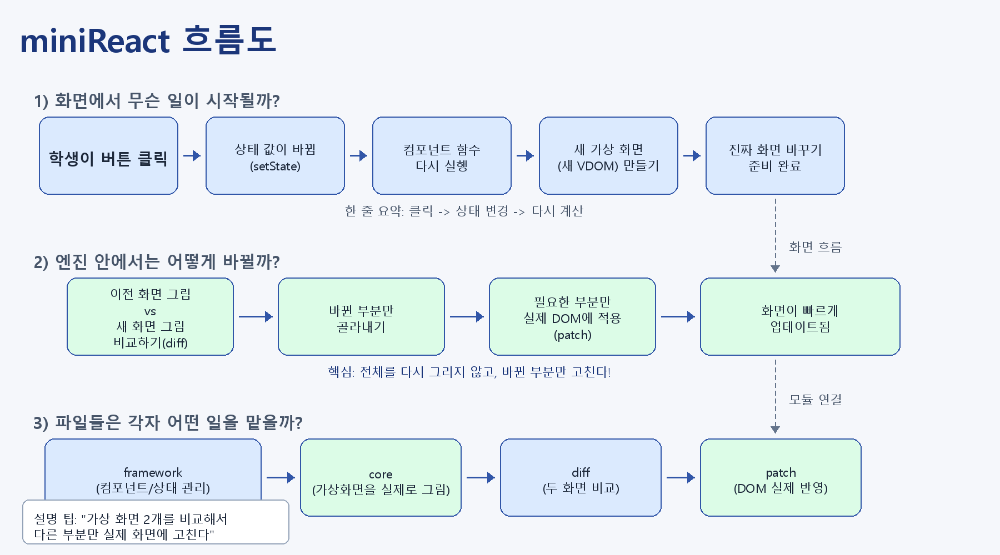

# Week 5 React Learning Page

## 1. 프로젝트 소개

이 프로젝트는 React의 핵심 개념을 "읽는 설명"이 아니라 "직접 수정하고 바로 확인하는 학습 경험"으로 바꾸기 위해 만든 **React 학습 페이지**입니다.  
가장 큰 특징은 학습 페이지 자체가 우리가 직접 구현한 **mini React 프레임워크** 위에서 동작한다는 점입니다.

즉, 이 프로젝트는 두 가지를 동시에 보여 줍니다.

- React 개념을 배우는 학습 페이지
- 그 학습 페이지를 실제로 실행하는 mini React 엔진

이 README는 다음 문서를 기준으로 정리했습니다.

- [프로젝트 계획 문서](./docs/project-plan.md)
- [AI Convention](./docs/AI%20Convention.md)
- [요구사항 체크리스트](./docs/requirements-checklist.md)



### 핵심 목표

- `Component`, `Props`, `State`, `Hooks`, `Virtual DOM`, `Diff`, `Patch` 흐름을 단계적으로 설명한다.
- 학습자가 코드를 직접 수정하고 결과를 라이브 프리뷰로 바로 확인할 수 있게 한다.
- `Lifting State Up`과 `Virtual DOM -> Diff -> Patch` 흐름을 눈으로 이해할 수 있게 만든다.
- 마지막에는 여러 컴포넌트를 조립하는 `Workshop` 섹션으로 학습을 마무리한다.

### 실제 학습 페이지 구성

1. Component & Props
2. Hooks (`useState`, `useEffect`, `useMemo`)
3. State 위치 올리기 (`Lifting State Up`)
4. Virtual DOM이 하는 일
5. Component 조립 Workshop

### 기술 스택

- HTML / CSS / Vanilla JavaScript
- Custom mini React
- 기존 Week 3 자산 재사용
  - `src/core`
  - `src/diff`
  - `src/patch`

### 실행 포인트

- 학습 페이지 진입: `index.html`
- 테스트 페이지 진입: `tests/framework.test.html`

---

## 2. Component란, State란, Hook이란

### Component란

Component는 UI를 작은 함수 단위로 나누는 방식입니다.  
이 프로젝트에서는 `ProfileCard`, `TemperatureInput`, `ResultCard` 같은 작은 단위를 만들어서 화면을 조립합니다.

핵심은 다음 두 가지입니다.

- **재사용성**: 같은 컴포넌트를 여러 번 호출해도 props만 바꾸면 다른 화면을 만들 수 있다.
- **역할 분리**: 부모는 화면을 조립하고, 자식은 자신이 맡은 조각만 렌더링한다.

이 프로젝트에서는 `Component + Props` 섹션에서 이 개념을 가장 먼저 설명하고, 같은 컴포넌트를 여러 번 재사용하는 챌린지까지 연결합니다.

### State란

State는 컴포넌트가 "기억해야 하는 값"입니다.  
예를 들어 카운터 숫자, 입력창 값, 현재 선택된 항목 같은 값은 한 번 렌더링하고 끝나는 정보가 아니라 계속 바뀌는 정보이기 때문에 state로 관리합니다.

이 프로젝트에서 state는 다음 흐름으로 이해할 수 있습니다.

- `useState(initialValue)`로 값을 저장한다.
- setter가 호출되면 컴포넌트가 다시 렌더링된다.
- 새 Virtual DOM과 이전 Virtual DOM을 비교한 뒤, 바뀐 부분만 DOM에 반영한다.

또한 여러 컴포넌트가 같은 값을 함께 써야 할 때는 state를 부모로 올려서 공유하는데, 이것이 바로 `Lifting State Up`입니다.

### Hook이란

Hook은 함수형 컴포넌트에 "기억", "부수 효과", "계산 결과 재사용" 같은 기능을 붙여 주는 규칙입니다.

이 프로젝트에서는 세 가지 Hook을 직접 구현하고 설명합니다.

- `useState`
  - 컴포넌트가 값을 기억하게 한다.
- `useEffect`
  - 렌더링 이후 실행해야 하는 작업을 등록한다.
- `useMemo`
  - 값이 바뀌지 않았다면 이전 계산 결과를 재사용한다.

즉, Hook은 단순히 문법이 아니라 **함수형 컴포넌트가 상태를 갖고 동작하게 만드는 핵심 장치**입니다.

---

## 3. flow 상세

### 3-1. 학습 페이지 flow

학습자는 다음 순서로 프로젝트를 경험합니다.

1. 왼쪽 네비게이션에서 챕터를 선택한다.
2. 가운데 영역에서 개념 설명과 코드 예제를 읽는다.
3. 오른쪽 실습 영역에서 starter code를 실행한다.
4. 코드를 수정한 뒤 `실행` 버튼을 눌러 결과를 바로 확인한다.
5. 챌린지를 통해 개념을 다시 적용해 본다.
6. 마지막 Workshop에서 여러 컴포넌트를 조립하며 학습을 마무리한다.

즉, 이 프로젝트의 학습 흐름은 아래처럼 설계되어 있습니다.

```text
설명 읽기 -> 예제 보기 -> 직접 수정하기 -> 결과 확인하기 -> 챌린지 해결하기
```

### 3-2. mini React 렌더링 flow

이 프로젝트의 핵심 기술 흐름은 다음과 같습니다.

```text
h()
-> component / element VNode 생성
-> renderApp()
-> FunctionComponent.mount()
-> render()
-> Hook 배열과 hookIndex로 현재 상태 읽기
-> Virtual DOM 생성
-> renderVdom()로 초기 DOM 마운트
```

상태가 바뀌면 아래 흐름으로 업데이트됩니다.

```text
setState()
-> FunctionComponent.update()
-> 새 Virtual DOM 생성
-> diff(oldVdom, newVdom)
-> applyPatches()
-> runEffects()
-> 실제 DOM 갱신
```

### 3-3. Playground flow

오른쪽 실습 영역은 단순 코드 뷰어가 아니라 실제 실행 영역입니다.

1. 학습자가 코드를 수정한다.
2. `createPlayground()`가 코드를 실행한다.
3. 실행 시 `h`, `useState`, `useEffect`, `useMemo`, `renderApp`를 주입한다.
4. 결과를 preview 영역에 렌더링한다.
5. 필요하면 `VDOM viewer`와 diff 시각화까지 함께 보여 준다.

이 구조 덕분에 학습자는 "개념 설명"과 "실제 동작"을 한 화면 안에서 연결해서 볼 수 있습니다.

### 3-4. 발표 시연 flow

발표에서는 아래 순서로 보여 주면 흐름이 자연스럽습니다.

1. `Component & Props`
   - 같은 카드 컴포넌트를 props만 바꿔 재사용하는 장면 시연
2. `Hooks`
   - `useState`로 값이 기억되는 모습
   - `useEffect`로 렌더 이후 작업이 실행되는 모습
   - `useMemo`로 재계산 조건이 달라지는 모습
3. `State 위치 올리기`
   - 부모가 state를 들고 자식이 props로 값을 공유하는 모습
4. `Virtual DOM`
   - old tree / new tree / patch list 설명
5. `Workshop`
   - 여러 컴포넌트를 조립하고 버튼 상호작용까지 확인
6. `테스트 페이지`
   - smoke test를 다시 실행하면서 검증 흐름 마무리

---

## 4. 협업방식

이 프로젝트는 기획 문서에서 정의한 역할 분담을 기준으로 협업했습니다.

### 역할 분담

| 역할                    | 담당 범위                                         | 대표 파일                                      |
| ----------------------- | ------------------------------------------------- | ---------------------------------------------- |
| A. 프레임워크 엔진      | mini React 동작 구현                              | `src/framework/*`                              |
| B. 학습 페이지 UI       | 레이아웃, playground, diff 시각화, 스타일, README | `src/ui/*`, `src/styles/main.css`, `README.md` |
| C. 학습 콘텐츠 + 테스트 | 각 섹션 설명, 예제, 챌린지, 테스트 페이지         | `src/pages/*`, `tests/*`                       |

### 협업 원칙

- 작업 전에 반드시 `docs/project-plan.md`와 `docs/AI Convention.md`를 먼저 확인한다.
- 각 역할은 자신의 책임 범위를 우선 처리한다.
- 다른 역할의 파일을 건드려야 할 때는 최소 범위만 수정한다.
- 엔진, UI, 콘텐츠를 분리해 병렬 작업이 가능하도록 구조를 유지한다.

### 실제 협업 흐름

#### Phase 1. 기반 구현

- A: `FunctionComponent`, `useState` 등 엔진 기본 동작 구현
- B: 학습 페이지 레이아웃과 playground 껍데기 구현
- C: Component 섹션 콘텐츠와 테스트 골격 작성

#### Phase 2. 연결

- A + B: 프레임워크를 playground에서 실제 실행 가능하게 연결
- A: `useEffect`, `useMemo` 완성
- C: Hooks 섹션과 테스트 확장

#### Phase 3. 통합

- B + C: 모든 섹션을 하나의 학습 페이지로 통합
- C: Workshop 섹션과 통합 테스트 정리
- B: diff 시각화와 스타일 마무리

#### Phase 4. 발표 준비

- README 정리
- 테스트 흐름 정리
- 발표 시연 순서와 설명 포인트 정리

### 협업에서 중요했던 연결 방식

- A는 B와 C가 쓸 수 있는 API(`h`, `renderApp`, `useState` 등)를 명확히 제공한다.
- B는 엔진 내부 상태를 직접 만지지 않고 공개된 API만 사용한다.
- C는 학습 콘텐츠와 테스트를 실제 구현 상태에 맞춰 설계한다.

이렇게 역할을 나눈 덕분에 "엔진", "화면", "콘텐츠"가 서로 발목을 잡지 않고 병렬로 발전할 수 있었습니다.

---

## 5. 어려웠던 점 / 아쉬웠던 점

### 어려웠던 점

#### 1. Hook의 동작을 단순한 구조로 구현하는 것

React의 Hook은 겉보기에는 간단하지만, 실제로는 "렌더링 순서"와 "저장 위치"가 매우 중요합니다.  
이 프로젝트에서도 `hooks` 배열과 `hookIndex`를 통해 각 Hook이 자신의 자리를 기억하도록 만드는 과정이 가장 핵심이었습니다.

#### 2. State 변경을 DOM 갱신까지 자연스럽게 연결하는 것

`setState()`가 단순히 값만 바꾸는 것이 아니라,

```text
setState -> rerender -> diff -> patch -> DOM update
```

까지 이어져야 했기 때문에, 엔진과 UI를 함께 이해해야 했습니다.

#### 3. 학습용 UI와 실제 엔진 흐름을 동시에 맞추는 것

이 프로젝트는 단순한 데모 페이지가 아니라 학습 페이지이기 때문에,

- 설명이 쉬워야 하고
- 코드가 직접 실행돼야 하고
- 결과가 눈에 보여야 하며
- 테스트까지 따라와야 했습니다.

즉, "보여 주는 화면"과 "실제로 동작하는 코드"를 동시에 설계해야 했던 점이 어려웠습니다.

### 아쉬웠던 점

#### 1. 실제 React의 모든 기능을 구현한 것은 아니다

이 프로젝트는 학습 목적의 mini React이기 때문에 다음과 같은 실제 React의 복잡한 기능까지는 다루지 않았습니다.

- Fiber 구조
- Concurrent Rendering
- Batching 최적화
- 정교한 스케줄링

즉, React의 핵심 개념 흐름을 설명하는 데 집중했고, 실제 React 전체를 복제하는 것이 목표는 아니었습니다.

#### 2. 테스트가 브라우저 기반 smoke test 중심이다

현재 테스트 페이지는 발표와 학습에는 매우 적합하지만,

- 브라우저 기반 실행 흐름이 중심이고
- smoke test와 설명용 시나리오 보드가 함께 존재하며
- CI 수준의 자동화까지는 아직 연결되지 않았습니다.

추후에는 더 정교한 자동화 테스트 환경으로 확장할 수 있습니다.

#### 3. 학습 규칙과 엔진 규칙의 경계가 더 명확해질 수 있다

프로젝트는 학습 흐름상 "루트에서 state를 관리하고 자식은 props를 받는다"는 방향을 강조합니다.  
다만 이런 규칙은 현재 **학습 설계와 문서 기준으로는 충분히 설명되지만**, 엔진 차원에서 모두 강하게 제한하는 수준까지는 아닙니다.

이 부분은 앞으로 문서와 테스트를 더 정교하게 맞추면 발표 때도 더 명확하게 전달할 수 있습니다.

---

이 프로젝트의 핵심 문장은 아래 한 줄로 정리할 수 있습니다.

> "React를 설명하는 페이지를 만드는 것이 아니라, 우리가 만든 mini React 위에서 직접 React를 배우는 페이지를 만든 프로젝트입니다."
